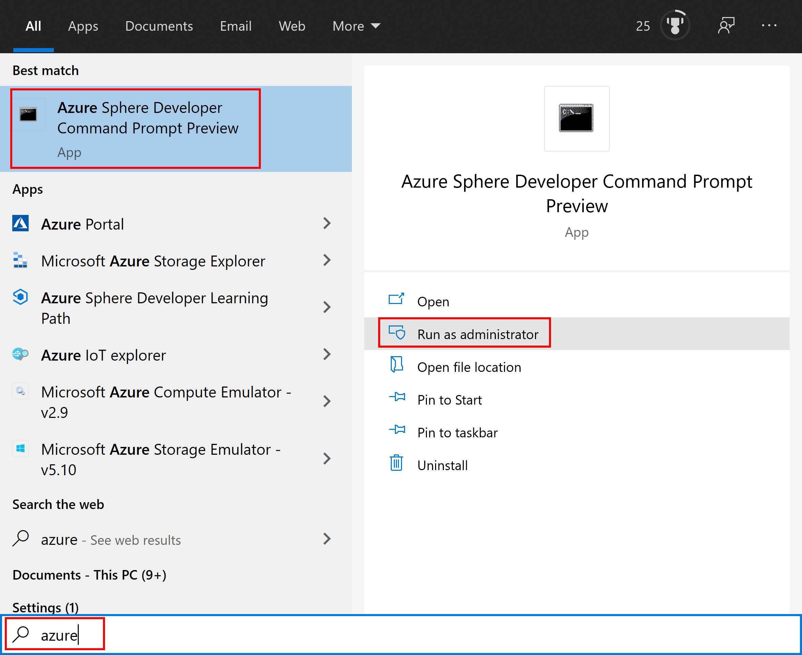
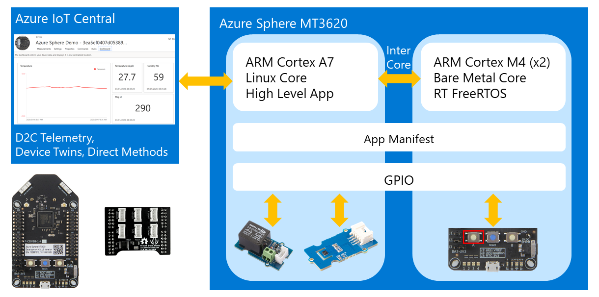

# Integrating Azure RTOS with Azure Sphere Inter-Core Messaging

<!--  -->

---

## Acknowledgements

This lab builds on the [MediaTek MT3620 M4 Driver & Real-Time Application Sample Code](https://github.com/MediaTek-Labs/mt3620_m4_software)

---

## What you will learn

You will learn how to deploy a [Azure RTOS](https://azure.microsoft.com/services/rtos/) application to an Azure Sphere Cortex M4 Real-Time core.

You can run Bare Metal applications or applications built on Real-Time frameworks such as Azure RTOS on the Azure Sphere Real-Time cores.

The reasons you would run applications on a Real-Time core include the need for precise or deterministic timing by sensors, migrating existing Cortex M4 code to the Azure Sphere, or to utilise all cores on the Azure Sphere to improve application performance.

In this lab, you will also learn about **Inter-Core** messaging.

---

## Prerequisites

You should have completed the set up steps in Lab 0. You should have:


1. Install Visual Studio 2019, version 16.4 or later.
2. Install [Azure Sphere SDK for Visual Studio](https://aka.ms/AzureSphereSDKDownload)
3. Plug in the device and open Azure Sphere Developer Command Prompt in the Start menu under Azure Sphere. Then run following commands:
- Login: 'azsphere login' or 'azsphere login --newuser \<email-address\>'
- Create tenant: 'azsphere tenant create --name \<my-tenant\>'
- Enable app development: 'azsphere device enable-development'
- Claim your device: 'azsphere device claim' (Note: Claiming is a one-time operation that you cannot undo)
- You may need to update the OS by using 'azsphere device recover' if you have an older device.
4. Open Azure Sphere Developer Command Prompt with administrator privilege and run 'azsphere device enable-development --enablertcoredebugging'.

Note: Skip the above steps if you have already done it before.

5. Connect PC UART(or USB-to-serial adapter) Rx to Seeed MT3620 Development Kit GPIO 26 / TXD0 (ISU0_UART_TX), connect Ground pins together. See [MT3620_RTApp_BareMetal_HelloWorld](https://github.com/MediaTek-Labs/mt3620_m4_software/blob/master/MT3620_M4_Sample_Code/BareMetal/MT3620_RTApp_BareMetal_HelloWorld/README.md) for details.

### References

- [Set up your Windows PC for app development](https://docs.microsoft.com/en-ca/azure-sphere/install/development-environment-windows)
- [Claim your device](https://docs.microsoft.com/en-ca/azure-sphere/install/claim-device)
- [Update the OS on an early dev kit](https://docs.microsoft.com/en-ca/azure-sphere/resources/update-old-seeed-os)

---

## Enable Real-Time Core Development

### Step 1: Enable Real-Time Core Debugging

Run the **Azure Sphere Developer Command Prompt** as **Administrator**.

1. Press the <kbd>Windows Key</kbd>
2. Start typing **Azure Sphere Developer Command Prompt**
3. Select **Run as administrator**

4. **Enable Real-Time core debugging**

    ```bash
    azsphere device enable-development -r
    ```

5. Exit the command prompt. Type **exit**, and then press return.

### Step 2: Enable the Real-Time Core Floating Point Toolchain

Copy the **AzureSphereRTCoreToolchainVFP.cmake** file found in the **Azure Sphere Learning Path** directory you just cloned to the Azure Sphere SDK CMakeFiles directory. The default destination directory is **C:\Program Files (x86)\Microsoft Azure Sphere SDK\CMakeFiles**.

---

## Tutorial Overview

1. Deploy your first Real-Time Core Azure RTOS Application to Azure Sphere.

---

## Key Concepts

In this lab, you will learn how to secure, deploy, and debug a **Real-Time** Azure RTOS application running on one of the Azure Sphere **Cortex M4** Real-Time cores.

As a reminder, the Azure Sphere has three application cores. The Cortex A7 runs High-Level applications, the two Cortex M4s run Real-Time applications.

Like High-Level applications, Real-Time core applications are locked down by default, so you need to grant permissions to access hardware resources.

For security, applications running on Real-Time cores cannot connect directly to **any** network.

In this lab and the next, you will learn about  **Inter-Core** messaging. Inter-Core messaging provides a secure channel for applications running on different cores to communicate.



### Inter-Core Messaging Security

When button A is pressed, the Azure Sphere High-Level application will send a message to the Azure RTOS application. The Azure RTOS application will then measure the temperature using the builtin sensor and returns the temperature to the High-Level app. The High-Level application will indicate if the temperature has changed by switch on an LED. Red if the temperature is higher than the previous reading, blue if lower, and green if the same as the previous reading.


Both the Azure RTOS application running on the Real-Time core and the High-Level application need **Inter-Core** messaging permissions. The **app_manifest.json** property **AllowedApplicationConnections** of both applications must include the _Component ID_ of the **Partner** application.

In the following Azure RTOS Real-Time **app_manifest.json** file, the **AllowedApplicationConnections** property is set to the Component ID of the High-Level application.

```json
{
  "SchemaVersion": 1,
  "Name": "demo_threadx",
  "ComponentId": "6583cf17-d321-4d72-8283-0b7c5b56442b",
  "EntryPoint": "/bin/app",
  "CmdArgs": [],
  "Capabilities": {
    "Gpio": [ "$LED2" ],
    "Uart": [ "$UART0" ],
    "I2cMaster": [ "$AVNET_MT3620_SK_ISU2_I2C" ],
    "AllowedApplicationConnections": [ "25025d2c-66da-4448-bae1-ac26fcdd3627" ]
  },
  "ApplicationType": "RealTimeCapable"
}
```

In the following High-Level **app_manifest.json** file, the **AllowedApplicationConnections** property is set to the Component ID of the Azure RTOS Real-Time application.

```json
{
  "SchemaVersion": 1,
  "Name": "AzureSphereIoTCentral",
  "ComponentId": "25025d2c-66da-4448-bae1-ac26fcdd3627",
  "EntryPoint": "/bin/app",
  "CmdArgs": [ "ignore", "6583cf17-d321-4d72-8283-0b7c5b56442b" ],
  "Capabilities": {
    "Gpio": [ "$LED_RED", "$LED_GREEN", "$LED_BLUE", "$BUTTON_A" ],
    "AllowedApplicationConnections": [ "6583cf17-d321-4d72-8283-0b7c5b56442b" ]
  },
  "ApplicationType": "Default"
}
```

---

## Delete Existing Applications on the Azure Sphere

1. There may be some GPIO pin reassignments from existing High-Level and Real-Time application running on the Azure Sphere. So delete any existing applications on the Azure Sphere to avoid any clashes.

    From the **Azure Sphere Developer Command Prompt**, run

    ```bash
    azsphere device sideload delete
    ```
2. Restart the Azure Sphere. From the **Azure Sphere Developer Command Prompt**, run

    ```bash
    azsphere device restart
    ```

---

## Open Lab 4

### Step 1: Start Visual Studio 2019


### Step 2: Open the lab project

1. Click **Open a local folder**
2. Open the Azure-Sphere lab folder
3. Open the **app_rt_azure_rtos** folder
4. Click **Select Folder** button to open the project

---

## Deploy the Azure RTOS Application to Azure Sphere

1. Set the startup configuration. Select the **ARM-Debug** configuration and the **GDB Debugger (RTCore)** startup item.

    
3. Press <kbd>**F5**</kbd>, this will start the build, deploy, attach debugger process. The **yellow app status LED** on the Azure Sphere will start **blinking**.

---

## Expected Behaviour

### Avnet Azure Sphere MT3620 Starter Kit


1. The yellow LED will start to blink

---

## Debugging Real-Time Core Applications

You can Debug the Azure RTOS application running on Azure Sphere Cortex M4 Real-Time Core.

1. From Visual Studio, open the Azure RTOS application **main.c** file.
2. Scroll down to the C function named **LedTask**.
3. Set a [Visual Studio Breakpoint](https://docs.microsoft.com/en-us/visualstudio/debugger/using-breakpoints?view=vs-2019&WT.mc_id=github-blog-dglover) in the **LedTask** function on the line that reads **rt = xSemaphoreTake(LEDSemphr, portMAX_DELAY);**

    
4. The code will stop executing at the breakpoint
    
5.  You can now start stepping through the code by pressing <kbd>**F10**</kbd> to step over, <kbd>**F11**</kbd> to step into, or <kbd>**F5**</kbd> to continue.
6. Explorer debugging, hover the mouse over the variable named **BuiltInLedOn** and you can see its current value.
7. Click on the **red dot** to delete the breakpoint, and press <kbd>**F5**</kbd> to continue execution.
8. Stop the debugging session. Press <kbd>Shift+F5</kbd>.

---

## Deploy the Azure RTOS Application to the Real-Time Core

This time we are going to deploy the Azure RTOS Real-Time application to the Azure Sphere in release mode without attaching the debugger.

1. Set the startup configuration. Select the ARM-Release configuration and the GDB Debugger (RTCore) startup item.
    
2. Press <kbd>Ctrl-F5</kbd>, or from the main menu select *Debug* -> *Start Without Debugging*.
3. This will deploy and run the application on the Azure Sphere.
4. Try pressing the Azure Sphere **Reset** button. You will notice the LED will start rapidly blinking again which indicates that the Azure RTOS Real-Time application has restarted after the reset.

---

## Close Visual Studio

Now close **Close Visual Studio**.

---

## Finished 完了 fertig finito समाप्त terminado


Congratulations you have finished lab 4.


---

**[NEXT](../Lab_5_Azure RTOS_and_Azure_IoT_Central/README.md)**

---
